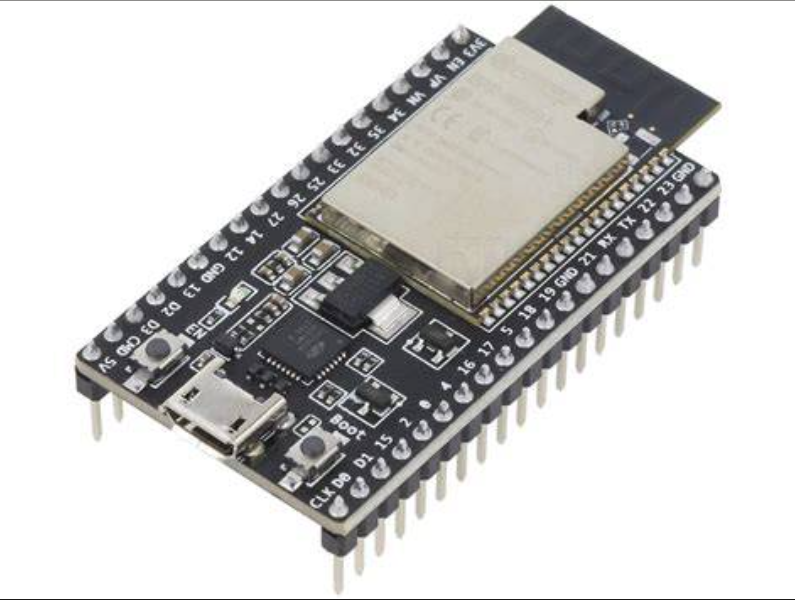
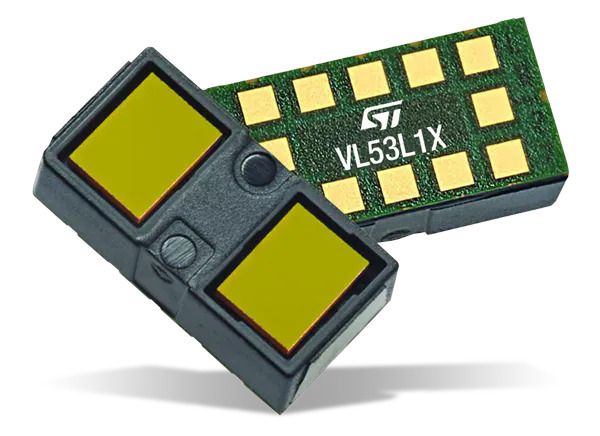
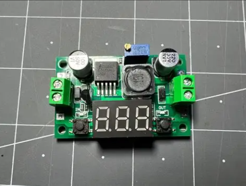
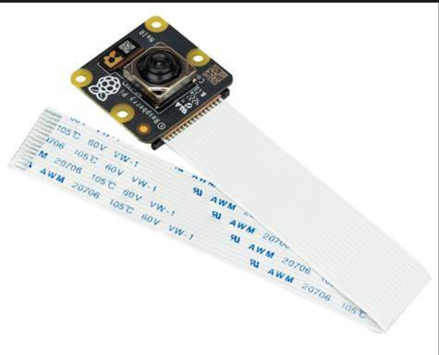
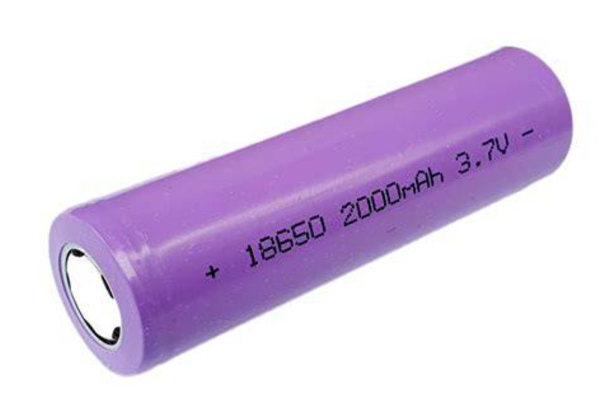

# WRO Future Engineers - Robot Component Reference

This folder is a component-only reference for the robot hardware used in the WRO 2025 Future Engineers project.
It intentionally avoids schematics, wiring, power-chain notes, firmware details, and software architecture.
This documentation was last updated on **Thursday, July 16, 2026**.

---

## Component Gallery

---

## Components Used

| Component | Role |
|-----------|------|
| Raspberry Pi 4 | High-level computing platform |
| ESP32 DevKit | Embedded control and sensor processing |
| LSM6DSO IMU | Motion and orientation sensing |
| VL53L1X ToF Sensor | Distance sensing |
| N20 Gearmotor with Encoder | Drive motor and feedback |
| L298N Motor Driver | Motor driver module |
| Steering Servo | Front steering actuation |
| 18650 Li-ion Battery Pack | Main power source |
| Buck Converter | Voltage regulation |
| Raspberry Pi Camera v3 | Vision input |

---

## Datasheets

PDF datasheets for each component will be uploaded here.

file names:

- `raspberry_pi_4_datasheet.pdf`
- `esp32_datasheet.pdf`
- `lsm6dso_datasheet.pdf`
- `vl53l1x_datasheet.pdf`
- `n20_motor_encoder_datasheet.pdf`
- `l298n_datasheet.pdf`
- `servo_datasheet.pdf`
- `18650_battery_datasheet.pdf`
- `buck_converter_datasheet.pdf`
- `pi_camera_v3_datasheet.pdf`
